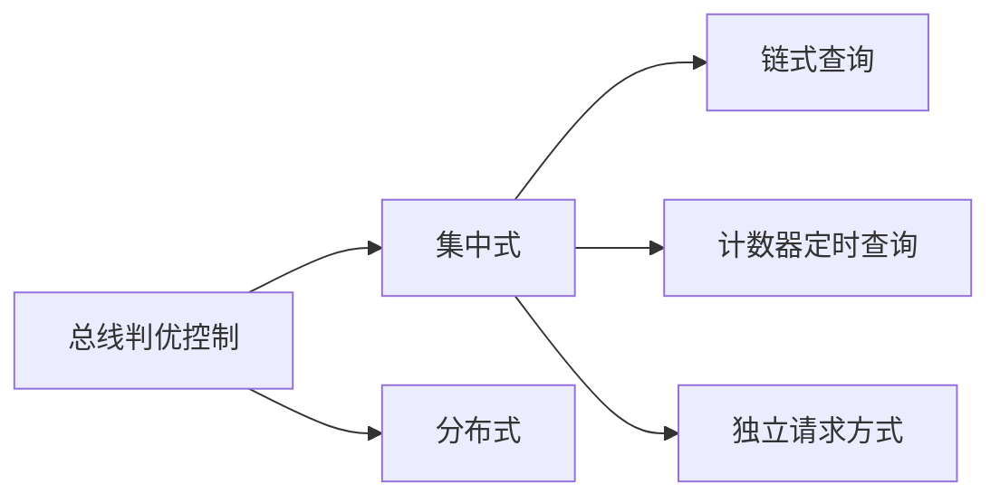

# 第3章 系统总线

## 3.1 总线的基本概念

总线(bus)是连接各个部件的信息传输线，是<font color='red'>各个部件共享的传输介质</font>

### 总线上信息的传送

串行：传输距离长

并行：传输距离短

> 哪种适合高速传输？

### 总线结构举例

|  |  |
| :----------------------------------------------------------: | :----------------------------------------------------------: |
|                          单总线结构                          |                     面向CPU的双总线结构                      |
|  |                                                              |
|                  以存储器为中心的双总线结构                  |                                                              |

## 3.2 总线的分类

1. 片内总线：芯片内部总线

2. 系统总线：计算机各部件之间的信息传输线
   ```mermaid
   graph LR
   A[系统总线]-->B[数据总线]-->E["双向 与机器字长、存储字长有关(通常小于等于)"]
   A-->C[地址总线]-->F["单向 与存储地址、I/O地址有关"]
   A-->D[控制总线]-->G["有出 有入"]
   G-->H["出：存储器读、存储器写、总线允许、中断确认"]
   G-->I["入：中断请求、总线请求"]
   ```

3. 通信总线：用于计算机系统之间或计算机系统与其他系统之间的通信
   ```mermaid
   graph LR
   A["传输方式"]-->B["串行通信总线"]
   A-->C["并行通信总线"]
   ```

## 3.3 总线特性及性能指标

### 总线物理实现


### 总线特性

1. 机械特性：尺寸、形状、管脚数及排列顺序
2. 电气特性：传输方向和有效的电平范围地址
3. 功能特性：每根传输线的功能（地址、数据、控制）
4. 时间特性：信号的时序关系

### 总线的性能指标

1. 总线宽度：数据线的根数
2. 标准传输率：每秒传输的最大字节数(`MBps`)
3. 时钟同步/异步：同步、不同步
4. 总线复用：地址线与数据线复用
5. 信号线数：地址线、数据线和控制线的总和
6. 总线控制：方式突发、自动、仲裁、逻辑、计数
7. 其他指标：负载能力

### 总线标准


## 3.4 总线结构

单总线结构

双总线结构


三总线结构

|  |  |
| ------------------------------------------------------------ | ------------------------------------------------------------ |

四总线结构


总线结构举例

|  |  |
| :----------------------------------------------------------: | :----------------------------------------------------------: |
|                      传统微型机总线结构                      |                      VL-BUS局部总线结构                      |
|  |  |
|                         PCI总线结构                          |                       多层PCI总线结构                        |


## 3.5 总线控制

### 一、 总线的判优控制

+ 主设备（模块）  对总线有控制权
+ 从设备（模块）  响应从主设备发来的总线命令



#### 链式查询


#### 计时器定时查询 


#### 独立请求方式


### 二、总线的通信控制

1. 目的：解决通信双方协调配合问题
2. 总线传输周期  
   + 申请分配阶段：主模块申请，总线仲裁决定
   + 寻址阶段：主模块向从模块给出地址和命令
   + 传数阶段：主模块和从模块交换数据
   + 结束阶段：主模块撇消有关信息

3. 总线通信的四种方式
   + 同步通信：由统一时标控制数据传送
   + 异步通信：采用应答方式，没有公共时钟标准
   + 半同步通信：同步、异步结合
   + 分离式通信：充分挖掘系统总线每个瞬间的潜力

#### 同步通信

|  |  |
| :----------------------------------------------------------: | :----------------------------------------------------------: |
|                        同步式数据输入                        |                        同步式数据输出                        |

> 总线要求短？

#### 异步通信


#### 半同步通信（同步、异步结合）

同步 发送方用系统时钟前沿发信号
		接收方用时钟后沿判断、识别

异步 允许不同速度的模块和谐工作 
		增加一条“等待”响应信号 $\overline{WAIT}$

以输入数据为例的半同步通信时序


#### 上述三种通信的共同点

一个总线传输周期（以输入数据为例）

+ 主模块发地址、命令	       <font color='red'>占用总线</font>
+ 从模块准备数据                  <font color='red'>不用占用总线</font> 总线空闲
+ 从模块（->主模块（分离式通信））向主模块发数据       <font color='red'>占用总线</font>

#### 分离式通信

充分挖掘系统总线每个瞬间的潜力

一个总线传输周期

+ 子周期1    主模块申请占用总线，使用完后即方去总线使用权
+ 子周期2    从模块申请占用总线，将各种信息送至总线上

##### 分离式通信的特点

+ 各模块有权申请占用总线
+ 采用同步方式通信，不等待对方回答
+ 各模块准备数据时，不占用总线
+ 总线被占用时，无空闲

充分提高了总线的有效占用

