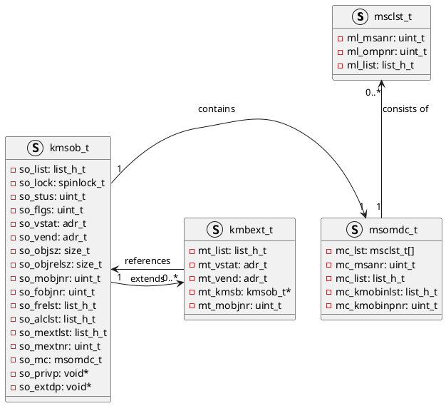

## 如何表示内存对象？
为了处理大量少于一个内存页的分配请求，使用内存对象的数据结构，将一个或多个内存页管理起来，专门用于内存的分配。
设计方案：把一个或多个内存页面分配出来，作为一个内存对象的容器，在这个容器中容纳相同的内存对象，即同等大小的内存块。
![[内存对象视图.png]]![[内存对象容器关系.png]]
``

```plantuml
@startuml

struct msclst_t {
    - ml_msanr: uint_t
    - ml_ompnr: uint_t
    - ml_list: list_h_t
}

struct msomdc_t {
    - mc_lst: msclst_t[]
    - mc_msanr: uint_t
    - mc_list: list_h_t
    - mc_kmobinlst: list_h_t
    - mc_kmobinpnr: uint_t
}

struct kmbext_t {
    - mt_list: list_h_t
    - mt_vstat: adr_t
    - mt_vend: adr_t
    - mt_kmsb: kmsob_t*
    - mt_mobjnr: uint_t
}

struct kmsob_t {
    - so_list: list_h_t
    - so_lock: spinlock_t
    - so_stus: uint_t
    - so_flgs: uint_t
    - so_vstat: adr_t
    - so_vend: adr_t
    - so_objsz: size_t
    - so_objrelsz: size_t
    - so_mobjnr: uint_t
    - so_fobjnr: uint_t
    - so_frelst: list_h_t
    - so_alclst: list_h_t
    - so_mextlst: list_h_t
    - so_mextnr: uint_t
    - so_mc: msomdc_t
    - so_privp: void*
    - so_extdp: void*
}

kmsob_t "1" -right-> "1" msomdc_t : contains
kmsob_t "1" -down-> "0..*" kmbext_t : extends
kmbext_t -right-> kmsob_t : references
msomdc_t "1" -up-> "0..*" msclst_t : consists of

@enduml
```

## 初始化内存对象
