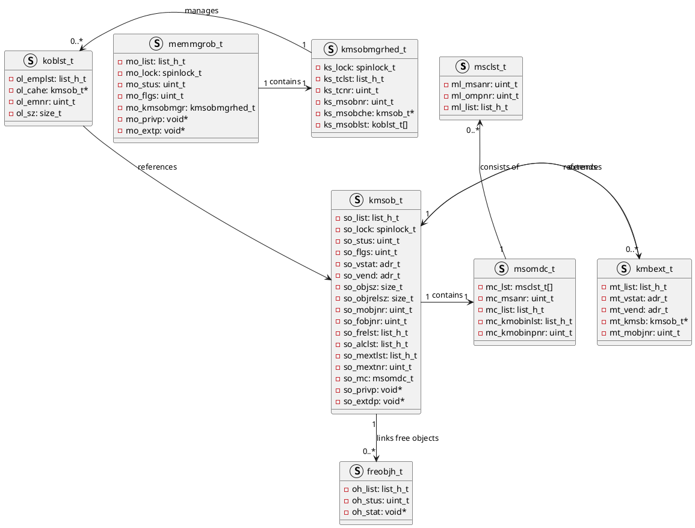

## 如何表示内存对象？
为了处理大量少于一个内存页的分配请求，使用内存对象的数据结构，将一个或多个内存页管理起来，专门用于内存的分配。
设计方案：把一个或多个内存页面分配出来，作为一个内存对象的容器，在这个容器中容纳相同的内存对象，即同等大小的内存块。
![[内存对象视图.png]]![[内存对象容器关系.png]]
``

> freobjh_t: 内存对象
> kmsob_t: 内存对象容器，即把很多相同大小的内存对象放到一个内存容器中
> kmbext_t: 内存对象容器的扩展内存
> msomdc_t和msclst_t管理内存对象容器占用的物理内存页面

